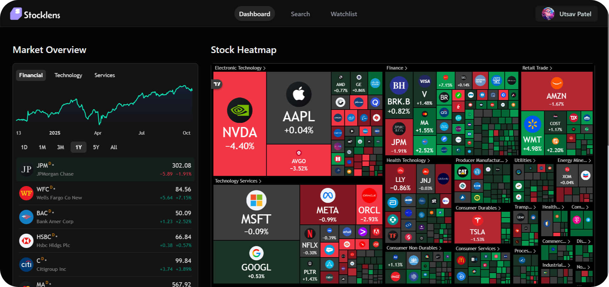

### 📈 StockLens – AI-Powered Stock Insights Dashboard
StockLens is an intelligent stock market analysis dashboard 📊 powered by AI-driven insights, real-time data visualization, and a modern, responsive UI. It provides traders and investors with interactive charts, news sentiment analysis, and personalized stock recommendations.



AI insights and summaries are powered by **Google AI Studio**, ensuring accurate and up-to-date market intelligence.

### 📸 Features

- 📊 Interactive Stock Charts (via TradingView API)
- 🧠 AI-Powered Market Summaries using **Google AI Studio**
- 💬 Real-Time News & Sentiment Analysis
- 🔔 Smart Notifications & Alerts with **Inngest**
- 📷 High-Quality Image Management via **ImageKit.io**
- 🔒 Secure Authentication using **better-auth**
- 🧾 Personalized Stock Watchlists stored in **MongoDB**
- 🎨 Modern, Responsive UI built with **Tailwind CSS & Shadcn**
- ⚙️ Smooth User Experience using **React-Hook-Form**

### 🛠️ Tech Stack and Usage

- **TypeScript** – For type-safe, scalable, and maintainable frontend and backend code.  
- **React.js** – For building the interactive and dynamic user interface.  
- **Tailwind CSS** – For fast, responsive, and modern styling across all components.  
- **Shadcn/UI** – For reusable, accessible, and polished UI components.  
- **React-Hook-Form** – For efficient and user-friendly form handling and validation.  
- **TradingView Widget API** – For displaying real-time and interactive stock market charts.  
- **Node.js** – For server-side logic and backend API management.  
- **MongoDB** – For storing user data, stock watchlists, and preferences.  
- **Inngest** – For handling background jobs, notifications, and event workflows.  
- **better-auth** – For secure and reliable authentication across the app.  
- **Google AI Studio (Gemini API)** – For generating AI-based stock summaries and insights.  
- **ImageKit.io** – For image optimization and fast content delivery.  
- **Finnhub API** – For fetching live financial data and stock market updates.

### 🚀 Installation

Clone the repository:
```bash
git clone https://github.com/utsavpatel562/StockLens.git
cd StockLens
```
Install dependencies:
```bash
npm install
```
Create a .env file at the project root and add your environment variables:
```bash
NODE_ENV = 'development'
NEXT_PUBLIC_BASE_URL = http://localhost:3000
MONGODB_URI = "YOUR_MONGODB_URL"
BETTER_AUTH_SECRET = "YOUR_AUTH_KEY" 
BETTER_AUTH_URL = http://localhost:3000
GEMINI_API_KEY = "YOUR_API_KEY"
NODEMAILER_EMAIL = "YOUR_NODE_MAILER"
NODEMAILER_PASSWORD = "YOUR_NODEMAILER_PASSWORD"
NEXT_PUBLIC_FINNHUB_API_KEY = "YOUR_API_KEY"
```
Start the development server:
```bash
npm run dev
```
Then visit http://localhost:3000 in your browser 🌐

### 📢 Contributing
Contributions are welcome! 🎉
If you find a bug or want to add new features, feel free to open an issue or submit a pull request.

### 🛡️ License
This project is licensed under the MIT License.

Made with ❤️ by Utsav Patel
